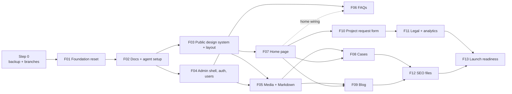

# Rogerio Pereira Website — Feature List

**Version:** 1.0 · **Source:** planning-new-website.md v2.1 (§11, §12) · **References:** [01 PRD](01%20PRD.md), [02 HLD](02%20HLD.md), [03 - Branding Manual](03%20-%20Branding%20Manual.md), [04 - Design System](04%20-%20Design%20System.md), ADRs in `ADRs/`, FDRs in `FDRs/`

This file is the source of truth for feature and wave status. Update it when a wave is merged.

**Convention:** every cross-reference to a feature uses `[FNN Short title](#fNN-slug)` (anchors and index below). FDR numbering: `FDR_001` = F01 … `FDR_013` = F13.

---

## Feature index

| Feature | Link | FDR | Status |
|---|---|---|---|
| Step 0 | [Step 0 Backup and branches](#step-0-backup-and-branches) | — | Done |
| F01 | [F01 Foundation reset](#f01-foundation-reset) | [FDR_001](FDRs/Done/FDR_001_foundation_reset.md) | Done (PR #1 open) |
| F01b | [F01b Foundation stack fix](#f01b-foundation-stack-fix) | [FDR_001](FDRs/Done/FDR_001_foundation_reset.md) | Done (PR #3 open) |
| F02 | [F02 Project docs and agent setup](#f02-project-docs-and-agent-setup) | [FDR_002](FDRs/Done/FDR_002_project_docs_and_agent_setup.md) | In progress |
| F03 | [F03 Public design system and layout](#f03-public-design-system-and-layout) | [FDR_003](FDRs/ToDo/FDR_003_public_design_system_and_layout.md) | To do |
| F04 | [F04 Admin shell, auth and users](#f04-admin-shell-auth-and-users) | [FDR_004](FDRs/ToDo/FDR_004_admin_shell_auth_and_users.md) | To do |
| F05 | [F05 Media and Markdown field](#f05-media-and-markdown-field) | [FDR_005](FDRs/ToDo/FDR_005_media_and_markdown_field.md) | To do |
| F06 | [F06 FAQs](#f06-faqs) | [FDR_006](FDRs/ToDo/FDR_006_faqs.md) | To do |
| F07 | [F07 Home page (static sections)](#f07-home-page-static-sections) | [FDR_007](FDRs/ToDo/FDR_007_home_page.md) | To do |
| F08 | [F08 Cases](#f08-cases) | [FDR_008](FDRs/ToDo/FDR_008_cases.md) | To do |
| F09 | [F09 Blog](#f09-blog) | [FDR_009](FDRs/ToDo/FDR_009_blog.md) | To do |
| F10 | [F10 Project request form](#f10-project-request-form) | [FDR_010](FDRs/ToDo/FDR_010_project_request_form.md) | To do |
| F11 | [F11 Legal pages and analytics](#f11-legal-pages-and-analytics) | [FDR_011](FDRs/ToDo/FDR_011_legal_pages_and_analytics.md) | To do |
| F12 | [F12 SEO files](#f12-seo-files) | [FDR_012](FDRs/ToDo/FDR_012_seo_files.md) | To do |
| F13 | [F13 Launch readiness](#f13-launch-readiness) | [FDR_013](FDRs/ToDo/FDR_013_launch_readiness.md) | To do |

ADRs: [ADR_001](ADRs/ADR_001_complete_refactor_fresh_starter_kit_frontporch_base.md) · [ADR_002](ADRs/ADR_002_client_side_inertia_server_side_seo_meta.md) · [ADR_003](ADRs/ADR_003_hybrid_css_tailwind_tokens_template_classes.md) · [ADR_004](ADRs/ADR_004_content_model_markdown_uuids.md) · [ADR_005](ADRs/ADR_005_media_storage_compression_orphan_deletion.md) · [ADR_006](ADRs/ADR_006_project_request_flow.md) · [ADR_007](ADRs/ADR_007_no_queues_workers_scheduler_redis.md) · [ADR_008](ADRs/ADR_008_legal_pages_analytics_no_cookie_banner.md) · [ADR_009](ADRs/ADR_009_hosting_laravel_cloud.md) · [ADR_010](ADRs/ADR_010_admin_auth_seeded_users.md) · [ADR_011](ADRs/ADR_011_delivery_workflow.md) · [ADR_012](ADRs/ADR_012_no_ai_in_the_site.md)

---

## Waves at a glance

| Wave | Runs | Features (max 3 in parallel) | Starts when | Status |
|---|---|---|---|---|
| 0 | Orchestrator alone, in order | Step 0, [F01](#f01-foundation-reset), [F02](#f02-project-docs-and-agent-setup) | Now | Done (Step 0, F01 and F02 merged) |
| 1 | 2 agents | [F03](#f03-public-design-system-and-layout), [F04](#f04-admin-shell-auth-and-users) | F02 merged | To do |
| 2 | 3 agents | [F05](#f05-media-and-markdown-field), [F06](#f06-faqs), [F07](#f07-home-page-static-sections) | F03 and F04 merged | To do |
| 3 | 3 agents | [F08](#f08-cases), [F09](#f09-blog), [F10](#f10-project-request-form) | All of wave 2 merged | To do |
| 4 | 2 agents | [F11](#f11-legal-pages-and-analytics), [F12](#f12-seo-files) | All of wave 3 merged | To do |
| 5 | Orchestrator alone | [F13](#f13-launch-readiness) | Wave 4 merged | To do |

Inside wave 2, [F06](#f06-faqs) does its backend and admin tasks in parallel; its last task (the FAQ section on the home page) waits until [F07](#f07-home-page-static-sections) is merged, then F06 rebases and finishes.

Delivery workflow (branches, worktrees, ports, orchestrator protocol, shared files): [ADR_011](ADRs/ADR_011_delivery_workflow.md).

---

## Features

### Step 0 · Backup and branches

Backup branch `bkp_20260924_old-website` and integration branch `new-website` created; old ignored leftovers removed from disk. **Status:** Done.

---

### F01 · Foundation reset

**Objective:** the repo holds a clean Laravel 13 Vue starter kit with FrontPorch's Sail setup, test tools and CI, and nothing from the old site.

**Branch:** `feat/f01-foundation` · **Wave:** 0 · **Depends on:** Step 0 · **Status:** Done (merged, PR #1)

**ADRs:** [ADR_001](ADRs/ADR_001_complete_refactor_fresh_starter_kit_frontporch_base.md), [ADR_007](ADRs/ADR_007_no_queues_workers_scheduler_redis.md) · **FDR:** [FDR_001](FDRs/Done/FDR_001_foundation_reset.md)

---

### F01b · Foundation stack fix

**Objective:** the base matches the Laravel 13 Vue starter kit (Laravel 13, Fortify with 2FA, Wayfinder, Tailwind 4, Vite 8, Inertia v3, reka-ui) that F03 and F04 assume; F01 had installed the old Laravel 12 kit.

**Branch:** `fix/f01b-foundation-stack` · **Wave:** 0 · **Depends on:** [F01](#f01-foundation-reset) · **Status:** Done (PR #3 open)

**FDR:** [FDR_001](FDRs/Done/FDR_001_foundation_reset.md) (deviation noted there). Passkeys are not used; email verification and registration stay until F04.

---

### F02 · Project docs and agent setup

**Objective:** the repository documentation (`docs/`, `.cursor/`, `CLAUDE.md`) exists, generated from the plan, so agents work from the repo docs.

**Branch:** `docs/f02-project-docs` · **Wave:** 0 · **Depends on:** [F01](#f01-foundation-reset) · **Status:** Done (merged, PR #2)

**ADRs:** [ADR_001](ADRs/ADR_001_complete_refactor_fresh_starter_kit_frontporch_base.md), [ADR_011](ADRs/ADR_011_delivery_workflow.md) · **FDR:** [FDR_002](FDRs/Done/FDR_002_project_docs_and_agent_setup.md)

---

### F03 · Public design system and layout

**Objective:** fonts, tokens, template styles, public layout, server-side SEO block, page head and pagination components, branded error pages.

**Branch:** `feat/f03-design-system` · **Wave:** 1 · **Depends on:** [F02](#f02-project-docs-and-agent-setup)

**ADRs:** [ADR_002](ADRs/ADR_002_client_side_inertia_server_side_seo_meta.md), [ADR_003](ADRs/ADR_003_hybrid_css_tailwind_tokens_template_classes.md) · **FDR:** [FDR_003](FDRs/ToDo/FDR_003_public_design_system_and_layout.md)

---

### F04 · Admin shell, auth and users

**Objective:** the FrontPorch admin shell under `/core`, auth without public registration, UUID users CRUD and seeders.

**Branch:** `feat/f04-admin-shell` · **Wave:** 1 · **Depends on:** [F02](#f02-project-docs-and-agent-setup)

**ADRs:** [ADR_010](ADRs/ADR_010_admin_auth_seeded_users.md), [ADR_004](ADRs/ADR_004_content_model_markdown_uuids.md) · **FDR:** [FDR_004](FDRs/ToDo/FDR_004_admin_shell_auth_and_users.md)

---

### F05 · Media and Markdown field

**Objective:** compressed image uploads, immediate deletion of orphan images, and the Markdown field with "Insert image".

**Branch:** `feat/f05-media-markdown` · **Wave:** 2 · **Depends on:** [F03](#f03-public-design-system-and-layout), [F04](#f04-admin-shell-auth-and-users)

**ADRs:** [ADR_005](ADRs/ADR_005_media_storage_compression_orphan_deletion.md), [ADR_004](ADRs/ADR_004_content_model_markdown_uuids.md) · **FDR:** [FDR_005](FDRs/ToDo/FDR_005_media_and_markdown_field.md)

---

### F06 · FAQs

**Objective:** FAQs table, seed, admin CRUD and the FAQ section of the home page.

**Branch:** `feat/f06-faqs` · **Wave:** 2 · **Depends on:** [F04](#f04-admin-shell-auth-and-users); task 4 also on [F07](#f07-home-page-static-sections) (merged)

**ADRs:** [ADR_004](ADRs/ADR_004_content_model_markdown_uuids.md) · **FDR:** [FDR_006](FDRs/ToDo/FDR_006_faqs.md)

---

### F07 · Home page (static sections)

**Objective:** the home route and the static sections migrated from the template (hero, proof strip, problem, services, how it works, fit check, about).

**Branch:** `feat/f07-home` · **Wave:** 2 · **Depends on:** [F03](#f03-public-design-system-and-layout)

**ADRs:** [ADR_002](ADRs/ADR_002_client_side_inertia_server_side_seo_meta.md), [ADR_003](ADRs/ADR_003_hybrid_css_tailwind_tokens_template_classes.md) · **FDR:** [FDR_007](FDRs/ToDo/FDR_007_home_page.md)

---

### F08 · Cases

**Objective:** the `case_studies` table and model, the `/core` admin, the public `/cases` pages and the latest-cases home section.

**Branch:** `feat/f08-cases` · **Wave:** 3 · **Depends on:** [F05](#f05-media-and-markdown-field), [F07](#f07-home-page-static-sections)

**ADRs:** [ADR_004](ADRs/ADR_004_content_model_markdown_uuids.md), [ADR_005](ADRs/ADR_005_media_storage_compression_orphan_deletion.md) · **FDR:** [FDR_008](FDRs/ToDo/FDR_008_cases.md)

---

### F09 · Blog

**Objective:** the `blog_articles` table and model, the `/core` admin, the public `/blog` pages and the latest-articles home section.

**Branch:** `feat/f09-blog` · **Wave:** 3 · **Depends on:** [F05](#f05-media-and-markdown-field), [F07](#f07-home-page-static-sections)

**ADRs:** [ADR_004](ADRs/ADR_004_content_model_markdown_uuids.md), [ADR_005](ADRs/ADR_005_media_storage_compression_orphan_deletion.md) · **FDR:** [FDR_009](FDRs/ToDo/FDR_009_blog.md)

---

### F10 · Project request form

**Objective:** the "Start a project" form: Slack notification and Calendly booking email, Turnstile, one successful send per IP per hour, nothing stored.

**Branch:** `feat/f10-project-request` · **Wave:** 3 · **Depends on:** [F07](#f07-home-page-static-sections)

**ADRs:** [ADR_006](ADRs/ADR_006_project_request_flow.md), [ADR_007](ADRs/ADR_007_no_queues_workers_scheduler_redis.md) · **FDR:** [FDR_010](FDRs/ToDo/FDR_010_project_request_form.md)

---

### F11 · Legal pages and analytics

**Objective:** Privacy and Terms pages, GA4 and Meta Pixel (env-gated), footer legal links.

**Branch:** `feat/f11-legal-analytics` · **Wave:** 4 · **Depends on:** [F10](#f10-project-request-form)

**ADRs:** [ADR_008](ADRs/ADR_008_legal_pages_analytics_no_cookie_banner.md) · **FDR:** [FDR_011](FDRs/ToDo/FDR_011_legal_pages_and_analytics.md)

---

### F12 · SEO files

**Objective:** `sitemap.xml`, `robots.txt` and `llms.txt`.

**Branch:** `feat/f12-seo-files` · **Wave:** 4 · **Depends on:** [F08](#f08-cases), [F09](#f09-blog)

**ADRs:** [ADR_002](ADRs/ADR_002_client_side_inertia_server_side_seo_meta.md) · **FDR:** [FDR_012](FDRs/ToDo/FDR_012_seo_files.md)

---

### F13 · Launch readiness

**Objective:** docs synced with the delivered site and the launch PR (`new-website` → `main`) open with the launch checklist.

**Branch:** `chore/f13-launch` · **Wave:** 5 · **Runs:** orchestrator · **Depends on:** everything

**ADRs:** [ADR_009](ADRs/ADR_009_hosting_laravel_cloud.md), [ADR_011](ADRs/ADR_011_delivery_workflow.md) · **FDR:** [FDR_013](FDRs/ToDo/FDR_013_launch_readiness.md)
