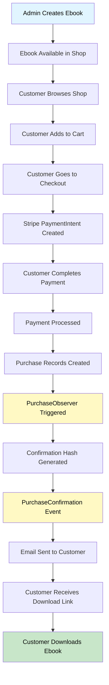
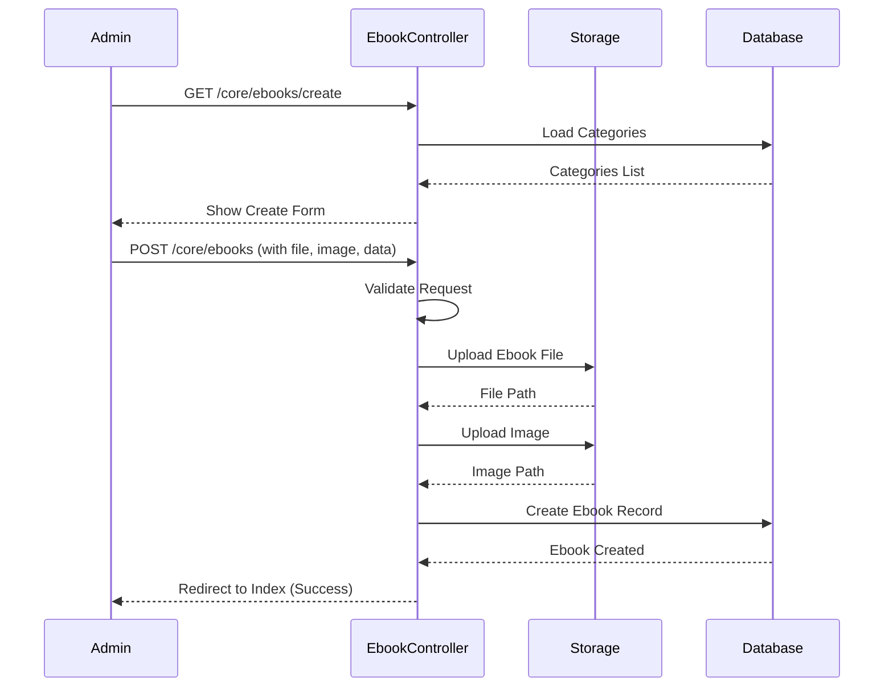
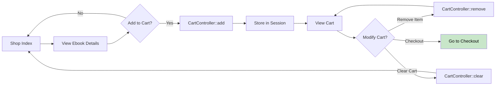
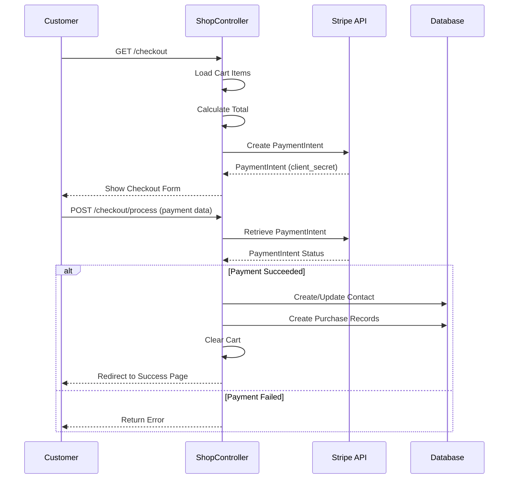
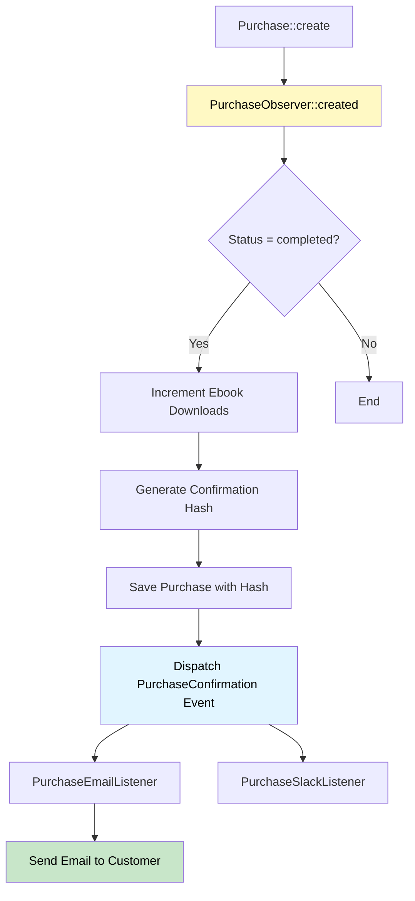
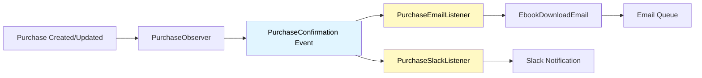
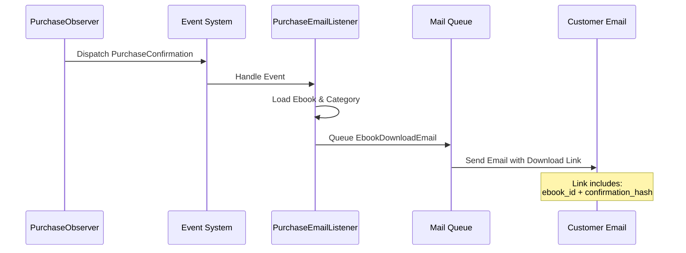
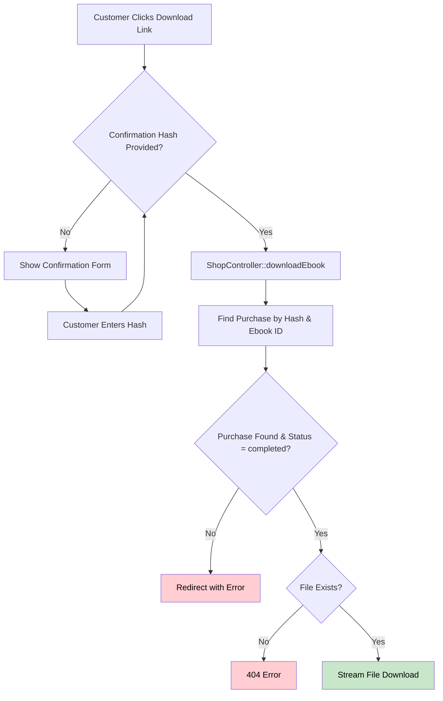
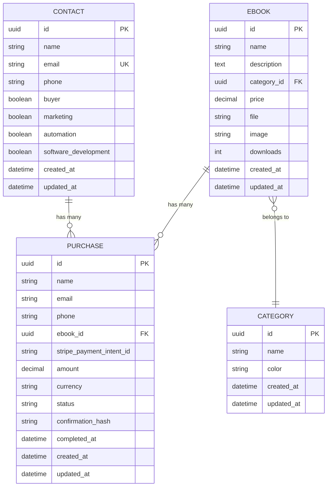

# Purchase Lifecycle Documentation

## Overview

This document describes the complete lifecycle of an ebook purchase, from the creation of the ebook in the admin area to the customer downloading the purchased ebook. The system uses Laravel with Stripe for payment processing and implements an event-driven architecture for purchase confirmations.

## Complete Purchase Lifecycle Flow



## Phase 1: Ebook Creation (Admin Area)

The ebook creation process happens in the admin area (`/core/ebooks`). Only authenticated administrators can access this area.

### Process Flow



### Key Components

- **Controller**: `App\Http\Controllers\Core\EbookController`
- **Model**: `App\Models\Ebook`
- **Request Validation**: `App\Http\Requests\Core\EbookRequest`
- **Storage**: Files stored in `storage/app/ebooks/` and `storage/app/ebooks/images/`

### Ebook Attributes

- `name`: Ebook title
- `description`: Ebook description
- `category_id`: Reference to category
- `price`: Price in USD (decimal)
- `file`: Path to the ebook file (PDF, etc.)
- `image`: Path to the cover image
- `downloads`: Counter for total downloads (auto-incremented on purchase)

## Phase 2: Shopping Cart Management

Customers can browse ebooks and add them to a session-based shopping cart.

### Cart Flow



### Cart Implementation

- **Storage**: Session-based (`session()->get('cart', [])`)
- **Structure**: Array of ebook IDs
- **Controller**: `App\Http\Controllers\CartController`
- **Routes**:
  - `GET /cart` - View cart
  - `POST /cart/add/{ebook}` - Add ebook to cart
  - `DELETE /cart/remove/{ebook}` - Remove ebook from cart
  - `DELETE /cart/clear` - Clear entire cart

## Phase 3: Checkout and Payment Processing

The checkout process integrates with Stripe PaymentIntent API to handle secure payments.

### Checkout Flow



### Payment Processing Details

1. **PaymentIntent Creation**: Created when customer visits checkout page
   - Amount calculated from cart items
   - Currency: USD
   - Metadata includes cart items

2. **Payment Verification**: After customer submits payment form
   - PaymentIntent status checked (must be 'succeeded')
   - Contact record created/updated
   - Purchase records created for each ebook in cart

3. **Contact Management**: 
   - Creates new contact or updates existing one
   - Sets `buyer` flag to `true`
   - Updates category interest flags based on purchased ebooks

## Phase 4: Purchase Processing and Observer Pattern

When a purchase is created, the `PurchaseObserver` automatically handles several important tasks.

### Purchase Observer Flow



### Confirmation Hash Generation

The confirmation hash is a URL-safe token that allows customers to download their purchased ebooks:

```php
hash = base64url(Hash::make(ebook_id + email + timestamp))
```

- **Purpose**: Secure download link without requiring authentication
- **Format**: Base64URL encoded (URL-safe)
- **Validation**: Must match purchase record with same ebook_id and status='completed'

### Event-Driven Architecture



## Phase 5: Email Notification

After a successful purchase, customers receive an email with a download link.

### Email Flow



### Email Customization

The email template is selected based on the ebook's category:
- **Automation** → `emails.ebook-download.automation`
- **Marketing** → `emails.ebook-download.marketing`
- **Software Development** → `emails.ebook-download.software-development`

### Email Content

- Purchase confirmation message
- Ebook name and description
- Download button with secure link
- Confirmation hash information

## Phase 6: Ebook Download

Customers can download their purchased ebooks using the confirmation hash sent via email.

### Download Flow



### Download Security

1. **Confirmation Hash Validation**: 
   - Must match a purchase record
   - Purchase must have status 'completed'
   - Purchase must be for the requested ebook

2. **File Validation**:
   - Ebook file path must exist
   - File must exist in storage

3. **Download Method**: Uses Laravel's `Storage::download()` for secure file streaming

## Data Models and Relationships

### Entity Relationship Diagram



## Key Routes

### Public Routes
- `GET /shop` - Shop index (all ebooks)
- `GET /shop/{category?}` - Shop filtered by category
- `GET /shop/ebook/{ebook}` - Ebook detail page
- `GET /cart` - Shopping cart
- `POST /cart/add/{ebook}` - Add ebook to cart
- `DELETE /cart/remove/{ebook}` - Remove ebook from cart
- `GET /checkout` - Checkout page
- `POST /checkout/process` - Process payment
- `GET /shop/success/{purchase}` - Success page
- `GET /ebooks/{ebook}/download/{confirmation?}` - Download ebook

### Admin Routes (Authenticated)
- `GET /core/ebooks` - List ebooks
- `GET /core/ebooks/create` - Create ebook form
- `POST /core/ebooks` - Store ebook
- `GET /core/ebooks/{ebook}/edit` - Edit ebook form
- `PUT /core/ebooks/{ebook}` - Update ebook
- `DELETE /core/ebooks/{ebook}` - Delete ebook
- `GET /core/ebooks/{ebook}/download` - Admin download

### Webhook Routes
- `POST /stripe/webhook` - Stripe webhook handler (CSRF excluded)

## Error Handling

### Common Error Scenarios

1. **Empty Cart**: Redirected to cart with error message
2. **Payment Failure**: JSON error response with message
3. **Invalid Confirmation Hash**: Redirected to download form with error
4. **File Not Found**: 404 error page
5. **Stripe API Errors**: Logged and user-friendly error returned

## Security Considerations

1. **Payment Security**: 
   - Stripe handles all payment data
   - PaymentIntent verification before purchase creation
   - Webhook signature verification

2. **Download Security**:
   - Confirmation hash prevents unauthorized downloads
   - Hash is unique per purchase and ebook
   - Status validation ensures only completed purchases can download

3. **Admin Access**:
   - All admin routes require authentication
   - Laravel Fortify handles authentication

4. **File Storage**:
   - Files stored in Laravel storage (not public directory)
   - Direct file access prevented
   - Download through application only

## Testing Considerations

The system includes comprehensive tests for:
- Ebook CRUD operations
- Cart management
- Checkout and payment processing
- Purchase observer behavior
- Download functionality
- Email notifications

## Summary

The purchase lifecycle is a well-structured, event-driven process that ensures:
- Secure payment processing through Stripe
- Automatic purchase confirmation and email delivery
- Secure download links via confirmation hashes
- Proper tracking of downloads and customer data
- Clean separation of concerns through observers and events

The system handles the complete journey from product creation to customer download, with proper error handling and security measures at each step.


